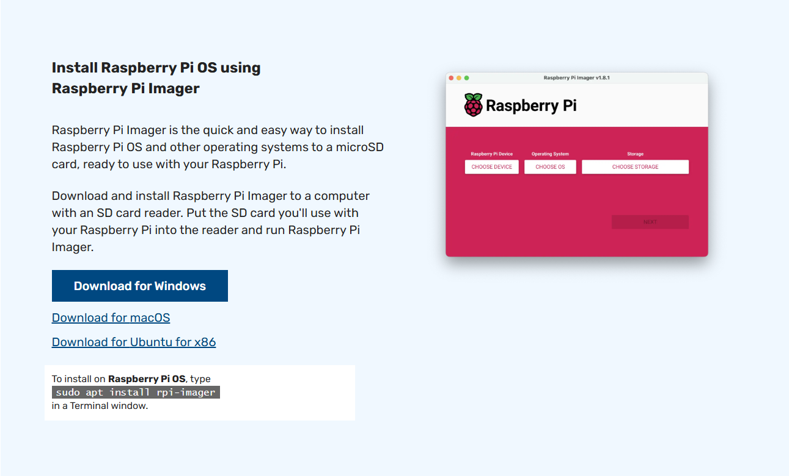
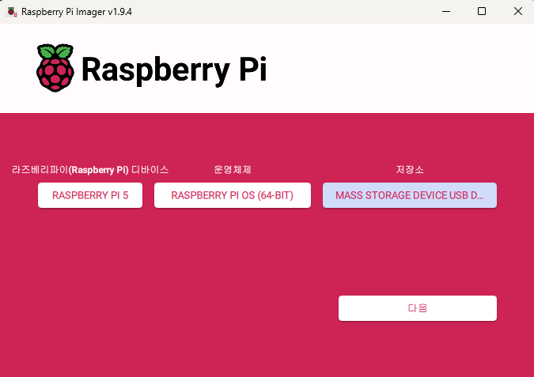
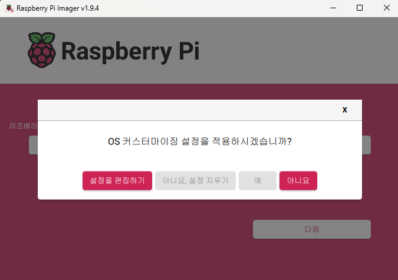
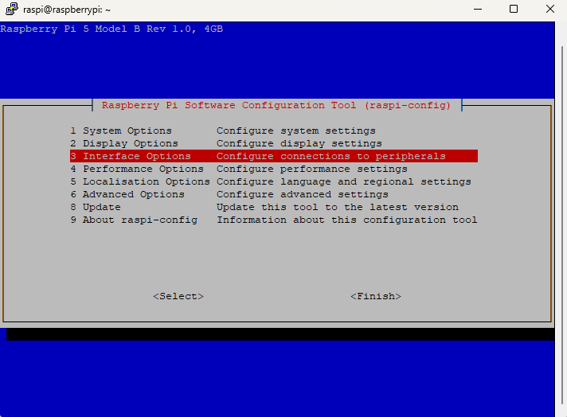
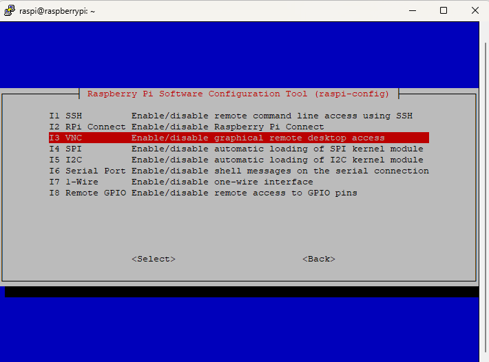

# 🌡️ 서버실 온습도 모니터링 시스템

Raspberry Pi와 Flask를 기반으로 한 **서버실 온습도 실시간 감시 시스템**입니다.


## 개요
- 서버실 내부의 온도 및 습도를 실시간으로 모니터링
- 기준치를 벗어날 경우 LED 점등 및 부저 경고
- Flask 기반 웹 대시보드 제공

## 주요 기능

- DHT11 센서로 온도/습도 측정 및 상태 판단 (6초 주기)
- 기준치 이상 시 LED(정상: 녹색, 이상: 빨간색) 색상 변경 및 부저 경고
- Flask 웹 대시보드에서 실시간 상태 확인 (비동기 fetch)
- MySQL DB에 모든 데이터 저장

## Raspberry Pi OS 설치 및 무선 설정 가이드 (Windows 기준)

### 1. Raspberry Pi Imager 다운로드 및 실행

- Raspberry Pi 공식 사이트 접속  
    - [https://www.raspberrypi.com/software/](https://www.raspberrypi.com/software/)

- **"Download for Windows"** 버튼 클릭하여 `.exe` 파일 다운로드

    

- 다운로드 완료 후 `.exe` 파일 실행

### 2. 설치 및 설정
1. **장치 선택**  
    - 사용하는 Raspberry Pi 모델 선택
2. **OS 선택**  
    - 원하는 Raspberry Pi OS 선택
3. **저장 장치 선택**  
    - 마이크로 SD 카드 선택

        

4. **설정 편집**
    - 라즈베리파이 디바이스, 운영체제, 저장소 설정 후 다음 클릭

    - OS 커스터마이징 설정을 적용
        - 설정을 편집하기 클릭

            

        - **Hostname**: 라즈베리파이의 네트워크 이름 지정  
        - **사용자 이름 및 비밀번호**: SSH 접속용 계정 설정  

        - **무선 네트워크 설정**
            - SSID : Wi-Fi 이름 입력 (공유기의 네트워크 이름 확인 후 입력)  
            - Password: Wi-Fi 비밀번호 입력  
            - 무선 LAN 국가 : `KR` (대한민국)

        - **로케일 설정**
            - 키보드 레이아웃: `kr`  
            - 언어/지역 설정: 한국어로 지정

        - **서비스**
            - SSH 활성화 체크 (원격 접속용)

5. 설정 후 ->  **저장** 클릭  -> 설치 진행


### 3. 공유기에서 Wi-Fi 정보 확인

- 웹 브라우저에서 `와이파이 IP` 접속
- 로그인 후 **[관리도구] → [무선랜 관리] → [Wi-Fi 기본설정]** 메뉴 이동
- **네트워크 이름 (SSID)** 및 **비밀번호** 확인


### 4. 소프트웨어 추가 다운로드

#### VNC Viewer 다운로드 (원격 데스크탑 연결용)

- VNC Viewer 공식 다운로드 페이지
    - [https://www.realvnc.com/en/connect/download/viewer/](https://www.realvnc.com/en/connect/download/viewer/)

- 사용 중인 OS(예: Windows)에 맞는 설치 파일 다운로드

#### SD Card Formatter 다운로드 (SD 카드 초기화용)

- SD 카드 포맷 공식 유틸리티
    - [https://www.sdcard.org/downloads/formatter/](https://www.sdcard.org/downloads/formatter/)
- Windows 또는 macOS용 다운로드 및 설치
- 마이크로 SD 카드 삽입 후 포맷 진행 (옵션: Quick Format 추천)

### 5. Raspberry Pi VNC 원격 접속 설정

#### SSH 접속 (PuTTY 사용)

1. **PuTTY 실행**  
2. Host Name에 **라즈베리파이 IP 주소 입력**  
    - 예: `192.168.0.xxx`
3. Port는 기본값 `22`, 연결 타입 `SSH`로 설정 후 `Open` 클릭  
4. 로그인 화면에서 다음 입력:
   - ID: `pi`  
   - Password: (설치 시 설정한 비밀번호)

#### VNC 기능 활성화

- SSH 접속 완료 후 명령어 입력

    ```bash
    sudo raspi-config
    ```

1. Interface Options 선택

    

2. VNC 선택

    

3. Would you like the VNC Server to be enabled?
    - Yes 클릭 후 Finish 후 종료
    
4. 라즈베리파이 재시작

    ```bash
    sudo reboot 
    ```

####  VNC Viewer로 원격 접속
- VNC Viewer 실행 -> 주소창에 라즈베리파이 IP 주소 입력 -> 사용자 이름과 비밀번호 입력

## 시스템 구조
- 센서 → Raspberry Pi → DB 저장 → Flask → 웹 대시보드
            ↘ LED/Buzzer  


## 기술 스택

- Python 3.11.9 + Flask
- RPi.GPIO
- MySQL
- HTML/CSS + JavaScript (Fetch API)

## 디렉토리 구조
```
project/
├── sensor_collector.py     # 센서 데이터 수집 + GPIO 제어
├── app.py                  # Flask 웹 서버 + API + 이메일 전송
├── config.py               # 임계값, SMTP, DB 설정
├── database.py             # MySQL 연결 및 쿼리 함수
├── send_email_alert.py     # 이메일 전송 함수
├── templates/index.html    # 대시보드 페이지
├── static/js/main.js       # 비동기 JS

```

## 실행 방법

1. 환경 설정
```bash
sudo apt install python3-pip
pip install flask pymysql
```

2. MySQL에 테이블 생성
```sql
CREATE TABLE sensor_data (
  id INT AUTO_INCREMENT PRIMARY KEY,
  temperature FLOAT,
  humidity FLOAT,
  status ENUM('NORMAL','ALERT'),
  created_at TIMESTAMP DEFAULT CURRENT_TIMESTAMP
);
```

3. Flask 서버 실행
```bash
python3 app.py
```

4. 센서 수집 스크립트 실행
```bash
python3 sensor_collector.py
```

### DB 테이블 생성
- MariaDB 연결 시 비밀번호 오류 발생
  - mysqld_safe를 동시에 두 번 실행해버렸음(MariaDB 서버 충돌 나고 소켓 파일도 꼬임)

1. MariaDB 관련 프로세스 완전 종료
```bash
sudo pkill -9 mysqld
sudo pkill -9 mariadbd

# 프로세스 확인
ps aux | grep mysqld
# "grep --color=auto mysqld" 한 줄만 남으면 성공
```

2. 필요한 디렉토리 소유권 복구
```bash
sudo chown -R mysql:mysql /var/lib/mysql
sudo chown -R mysql:mysql /run/mysqld
```

3. 안전모드 실행(비밀번호 초기화용, 한 번만 실행)
```bash
sudo mysqld_safe --skip-grant-tables --skip-networking &
```

4. 다른 터미널 or 탭에서 mysql 접속 시도
```bash
sudo mysql -u root
```

5. 비밀번호 초기화
```bash
USE mysql;

# 암호 재설정
UPDATE mysql.global_priv 
SET priv = JSON_SET(priv, '$.authentication_string', PASSWORD('12345')) 
WHERE User = 'root';

FLUSH PRIVILEGES;
```

6. mysqld_safe 종료 및 서비스 재시작
```bash

sudo pkill -f mysqld
sudo systemctl start 
```

2. MariaDB 서버 정상 시작
```bash
ps aux | grep mysqld
```

3. root 계정으로 정상 접속 테스트
```bash
mysql -u root -p
# 암호입력
```

mysql 접속 후
```bash
CREATE DATABASE sensordata;
USE sensordata;

CREATE TABLE sensor_data (
    id INT AUTO_INCREMENT PRIMARY KEY,
    temperature FLOAT,
    humidity FLOAT,
    created_at TIMESTAMP DEFAULT CURRENT_TIMESTAMP,
    led_state BOOLEAN DEFAULT FALSE,
    buzzer_state BOOLEAN DEFAULT FALSE
);
```
- Flask 서버
- JavaScript의 fetch() 함수와 setInterval()을 이용한 비동기 주기 폴링 방식
- 브라우저를 새로고침하지 않아도, 백엔드 API(/api/data)에서 데이터를 n초마다 자동으로 가져와 화면에 갱신하는 방식

```html
fetchData();                  // 페이지 처음 로딩 시 1회 실행
setInterval(fetchData, 5000); // 이후 5초마다 fetchData 반복 호출 (비동기 폴링)
```

### SMTP 메일 발송
- Gmail은 일반 계정 비밀번호로 SMTP 접속 막아둠 > 앱 비밀번호 발급 필요
  - https://myaccount.google.com/apppasswords
  - 16자리 코드 PASSWORD에 입력

### 개선점
1. 그래프 시각화
- Chart.js를 사용하여 온도/습도 데이터를 실시간 선 그래프로 표시
- 1초마다 /api/data 호출하여 새 데이터 반영

2. 부트스트랩 아이콘 추가
- 상단 제목 옆에 thermometer-half, droplet, clock 등의 아이콘 추가
- Bootstrap 5의 bootstrap-icons CDN 포함

3. 임계값 초과 시 강조 색상
- 온도 28도 초과 → 빨간색 (text-danger)
- 습도 60% 초과 → 파란색 강조 (text-primary fw-bold)
- 조건에 따라 CSS 클래스를 동적으로 변경

4. 메일 발송시 앱 멈춤 여부
- 메일 발송은 기본적으로 동기(synchronous) 처리되며, SMTP 응답이 느리면 전체 코드 흐름이 잠시 멈춤
- 해결 방법
  - 스레드(Thread)로 처리

