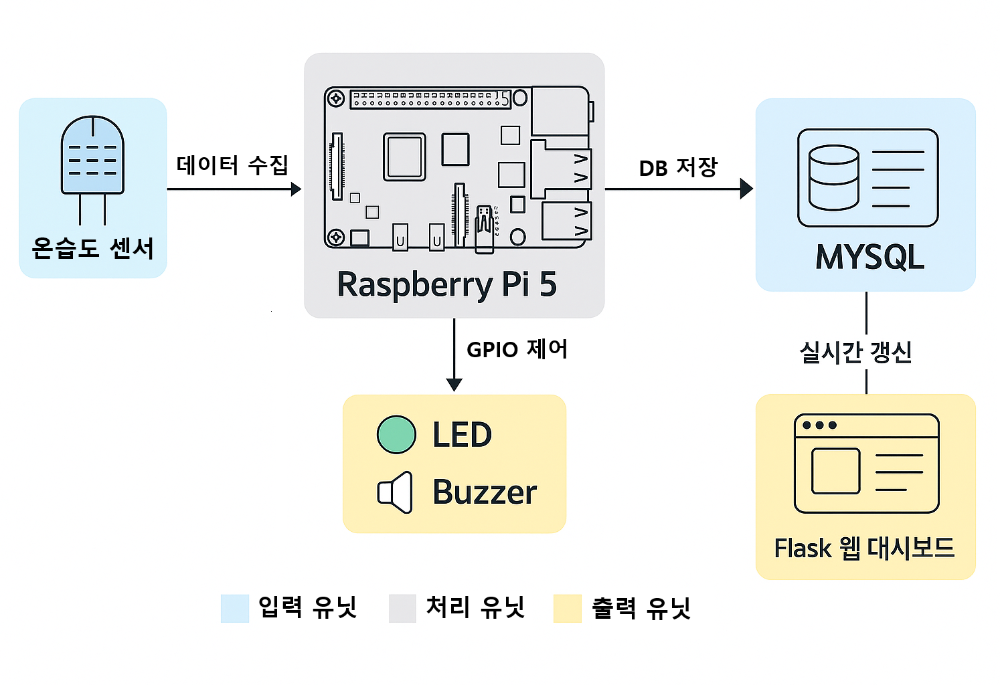

# 🌡️ 서버실 온습도 모니터링 시스템

Raspberry Pi와 Flask를 기반으로 한 **서버실 온습도 실시간 감시 시스템**입니다.

## 개요
- 서버실 내부의 온도 및 습도를 실시간으로 모니터링
- 기준치를 벗어날 경우 LED 점등 및 부저 경고
- Flask 기반 웹 대시보드 제공

## 📌 주요 기능

- DHT11 센서로 온도/습도 측정 및 상태 판단 (6초 주기)
- 기준치 이상 시 LED(정상: 녹색, 이상: 빨간색) 색상 변경 및 부저 경고
- Flask 웹 대시보드에서 실시간 상태 확인 (비동기 fetch)
- MySQL DB에 모든 데이터 저장

## 🖼️ 시스템 구조
- 센서 → Raspberry Pi → DB 저장 → Flask → 웹 대시보드
            ↘ LED/Buzzer  



## 🧱 기술 스택

- Python 3.11.9 + Flask
- RPi.GPIO
- MySQL
- HTML/CSS + JavaScript (Fetch API)

## 📁 디렉토리 구조
```
project/
├── app.py               # Flask 서버
├── sensor_collector.py  # 센서 수집 및 GPIO 제어
├── config.py            # 기준 온도/습도 설정
├── database.py          # DB 연결 유틸
├── templates/index.html # 대시보드
├── static/js/main.js    # 비동기 fetch
└── README.md

project/
│
├── sensor_collector.py    # 센서 수집 및 GPIO 제어
├── app.py                 # Flask 서버
├── templates/
│   └── index.html         # 대시보드
├── static/
│   └── js/
│       └── main.js        # 비동기 JS (fetch 사용)
├── config.py              # 온/습도 기준치 및 설정
└── database.py            # DB 연결 유틸
```

## ⚙️ 실행 방법

1. 환경 설정
```bash
sudo apt install python3-pip
pip install flask pymysql
```

2. MySQL에 테이블 생성
```sql
CREATE TABLE sensor_data (
  id INT AUTO_INCREMENT PRIMARY KEY,
  temperature FLOAT,
  humidity FLOAT,
  status ENUM('NORMAL','ALERT'),
  created_at TIMESTAMP DEFAULT CURRENT_TIMESTAMP
);
```

3. Flask 서버 실행
```bash
python3 app.py
```

4. 센서 수집 스크립트 실행
```bash
python3 sensor_collector.py
```

📊 미리보기
대시보드에서 현재 온도/습도 및 상태를 실시간 표시합니다.


1. 기능별 마일스톤
단계	기능	설명
1단계		환경 구성	Raspberry Pi 설정, Python 패키지 설치 (Flask, GPIO, pymysql 등)
2단계		센서 데이터 수집	DHT 센서값 주기적 수집, 기준치 이상이면 LED/Buzzer 제어
3단계	DB 연동	MySQL DB에 6초마다 온습도 값 및 상태 저장
4단계	웹 대시보드 기본	Flask 웹 서버 구축, HTML+JS로 실시간 데이터 표시
5단계	비동기 갱신	JavaScript fetch로 최신 온습도 상태 6초마다 업데이트
6단계	상태 색상 표시	정상: 초록 / 이상: 빨강 LED & 웹에서 시각적으로 표시
7단계	그래프 추가 (선택)	Chart.js 등을 활용해 과거 데이터 시각화
8단계	알림 기능 (선택)	이상 상태 시 이메일/텔레그램 알림 연동
9단계	최종 점검 및 배포	UI 정리, README 작성, github 

2. UI 설계 예시 (HTML 대시보드)
```pgsql
코드 복사
+----------------------------------------------------+
|           서버실 온습도 상태 모니터링              |
+----------------------------------------------------+
| 온도:   24.3°C           |   습도:  48.2%           |
| 상태:  ✅ 정상 (녹색)    |   측정 시간: 12:45:06    |
+----------------------------------------------------+
| [경고 LED] ●           [부저] OFF                  |
+----------------------------------------------------+
| [온도/습도 추이 그래프 영역]                       |
|  (Chart.js로 1시간 단위 표시)                      |
+----------------------------------------------------+
```
UI는 Bootstrap + JS 조합

측정값은 6초마다 fetch로 갱신

상태에 따라 배경/아이콘/글씨 색 변화

✅ 개요
서버실 내부의 온도 및 습도를 실시간으로 모니터링

기준치를 벗어날 경우 LED 점등 및 부저 경고

Flask 기반 웹 대시보드 제공

✅ 시스템 구성도
DHT11 → Raspberry Pi (GPIO) → DB 저장 → Flask 서버 → 웹 표시

✅ 주요 기능
6초 주기 센서 측정 및 상태 판단

LED (정상: 녹색, 이상: 빨간색), 부저 제어

MySQL DB에 로그 저장

웹 대시보드에서 실시간 확인 (비동기 fetch)

✅ 개발환경
Raspberry Pi 5

Python 3.x

Flask, RPi.GPIO

MySQL 8.x

JavaScript (fetch), HTML/CSS

✅ 개선 및 확장 가능성
상태 알림 (이메일, 텔레그램)

멀티 센서 / 구역 모니터링 (MQTT)

사용자 로그인 및 권한 관리